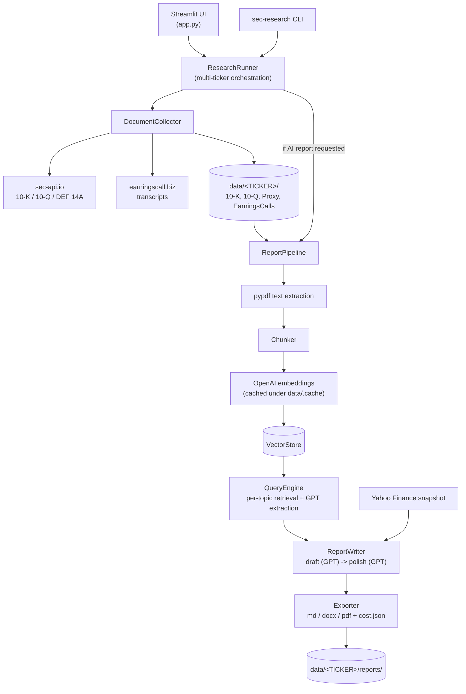

# SEC Research Agent

Collect SEC filings and earnings-call transcripts into a local, per-company archive, then
optionally turn them into an AI-written equity research report — as a Streamlit app or a CLI.

[](https://github.com/hammuneer/sec-research-agent/actions/workflows/ci.yml)
[](pyproject.toml)
[](LICENSE)
[](https://docs.astral.sh/ruff/)

## What it does

Give it a list of tickers and it will:

1. **Collect** the company's most recent 10-K, 10-Q and DEF 14A proxy filings (via
   [sec-api.io](https://sec-api.io)) and earnings-call transcripts (via
   [earningscall.biz](https://earningscall.biz)), rendered as PDFs and saved under
   `data/<TICKER>/`. Files already on disk are never re-downloaded.
2. **Optionally write a research report**: extract text from every stored PDF, chunk and
   embed it with OpenAI, retrieve the relevant chunks for a fixed set of research topics,
   have GPT extract and then draft and polish a report from them, and export it as
   Markdown, DOCX and PDF — alongside a JSON file recording exactly what it cost.

Everything is stored on your own filesystem. There's no login, no cloud storage and no
telemetry — the only network calls are to the three providers above (and Yahoo Finance for
a price/market-cap snapshot).

## Features

- **Local-first storage** — one folder per company, human-readable filenames, safe to
  browse or back up outside the app.
- **Idempotent collection** — reruns only fetch what's missing.
- **RAG-based report generation** — retrieval-augmented topic extraction over your own
  documents, not the model's training data.
- **Cost tracking** — every report writes a `*_cost.json` with token counts and an estimated
  USD cost per stage, priced from a configurable table.
- **Embedding cache** — re-generating a report for unchanged documents reuses cached
  embeddings instead of paying for them again.
- **Editable prompts** — the report-writing and editing prompts can be tweaked from the UI,
  with version history, without touching code.
- **Streamlit UI and CLI** — drive it interactively or script it for batch runs.

## Architecture


See [docs/architecture.md](docs/architecture.md) for the full component breakdown, storage
layout, embedding cache details, concurrency model and error handling; see
[docs/configuration.md](docs/configuration.md) for every setting.



## Quickstart

### Local

```bash
git clone https://github.com/hammuneer/sec-research-agent.git
cd sec-research-agent
python -m venv .venv && source .venv/bin/activate
pip install -e ".[dev]"
cp .env.example .env   # then edit .env with your API keys
streamlit run app.py
```

Open http://localhost:8501, add a ticker, and run. Reports need `OPENAI_API_KEY`; document
collection needs `SEC_API_KEY` and/or `EARNINGSCALL_API_KEY` (either can be omitted — the
missing document types are just skipped, and the UI tells you which keys aren't set).

### Docker

```bash
cp .env.example .env   # add your API keys
docker compose up --build
```

or without Compose:

```bash
docker build -t sec-research-agent .
docker run --rm -p 8501:8501 --env-file .env -v "$(pwd)/data:/data" sec-research-agent
```

The app is served on http://localhost:8501; documents and reports persist in `./data` on
the host through the mounted volume.

## Configuration

Secrets and paths come from environment variables (`.env`); models, limits and pricing come
from `config/settings.yaml`. Both have sensible defaults — nothing is required just to start
the app, but collection and reports need the relevant API key.

### Environment variables (`.env`)

| Variable | Required for | Default | Notes |
|---|---|---|---|
| `OPENAI_API_KEY` | AI reports (embeddings, extraction, writing) | — | https://platform.openai.com |
| `SEC_API_KEY` | 10-K / 10-Q / DEF 14A collection | — | https://sec-api.io |
| `EARNINGSCALL_API_KEY` | Earnings-call transcripts | — | https://earningscall.biz (legacy alias: `EARNING_CALL_API`) |
| `DATA_DIR` | no | `./data` | Where company folders are stored |
| `CONFIG_FILE` | no | `./config/settings.yaml` | Alternative settings file |
| `LOG_LEVEL` | no | `INFO` | Python logging level |

### `config/settings.yaml`

| Key | Default | Meaning |
|---|---|---|
| `models.extraction` | `gpt-4o-mini` | Model used for per-topic retrieval extraction |
| `models.report` | `gpt-5.4` | Model used to draft the report |
| `models.formatting` | `gpt-5.4` | Model used for the editorial polish pass |
| `models.embedding` | `text-embedding-3-small` | Embedding model for retrieval |
| `models.reasoning_effort` | `high` | GPT-5 family only: `none`, `low`, `medium`, `high`, `xhigh` |
| `documents.annual_reports` | `5` | Max 10-K filings kept per company |
| `documents.quarterly_reports` | `8` | Max 10-Q filings kept per company |
| `documents.proxy_statements` | `1` | Max DEF 14A filings kept per company |
| `documents.earnings_calls` | `8` | Max earnings-call transcripts kept per company |
| `concurrency.collection_workers` | `4` | Tickers collected in parallel |
| `concurrency.report_workers` | `2` | Reports generated in parallel |
| `concurrency.llm_workers` | `5` | Parallel topic extractions per report |
| `concurrency.pdf_workers` | `8` | Parallel PDF text extraction |
| `retrieval.chunk_size` | `4000` | Characters per chunk |
| `retrieval.chunk_overlap` | `400` | Character overlap between chunks |
| `retrieval.use_cache` | `true` | Reuse cached embeddings for unchanged documents |
| `report.brand_name` | `Involabs Financial Agent` | Header text on exported reports |
| `report.letterhead_image` | `null` | Optional full-width header image for the PDF |
| `pricing` | see file | USD per 1M tokens per model, used for cost estimates |

## Data folder layout

```
data/
└── <TICKER>/
    ├── 10-K/             annual reports (PDF)
    ├── 10-Q/             quarterly reports (PDF)
    ├── Proxy/            DEF 14A proxy statements (PDF)
    ├── EarningsCalls/    earnings-call transcripts, rendered to PDF
    └── reports/
        ├── <TICKER>_report_<timestamp>.md
        ├── <TICKER>_report_<timestamp>.docx
        ├── <TICKER>_report_<timestamp>.pdf
        └── <TICKER>_report_<timestamp>_cost.json
```

`data/.cache/embeddings/` holds the embedding cache; `data/.settings/report_prompts.json`
holds any prompt edits made from the Prompt settings page.

## How the AI report works

1. **Extract** — every stored PDF for the ticker is read with `pypdf` (in parallel).
2. **Chunk & embed** — text is split into overlapping chunks and embedded with OpenAI
   (`models.embedding`); results are cached per ticker/document fingerprint so unchanged
   documents don't get re-embedded on the next run.
3. **Retrieve & extract** — for each topic in
   `src/sec_research_agent/reports/templates/topics.yaml` (business model, financials, risk,
   moat, etc.), the most relevant chunks are retrieved and summarized by
   `models.extraction`.
4. **Draft** — `models.report` writes the full report from the topic extractions and a
   Yahoo Finance price/market-cap snapshot.
5. **Polish** — `models.formatting` does an editorial rewrite pass without changing facts.
6. **Export** — the final Markdown is converted to `.md`, `.docx` and `.pdf` and written to
   `data/<TICKER>/reports/`.

Every LLM call's token usage is recorded and priced from the `pricing` table in
`config/settings.yaml` (extend it as models/prices change; unpriced models report $0 and log
a warning rather than fail). The per-report `*_cost.json` breaks cost down by stage
(embeddings, topic extraction, drafting, polishing) so you can see where the money goes.
GPT-5-family models use the Responses API with a configurable `reasoning_effort`, which
increases both quality and token cost — turn it down (or to `none`) for cheaper runs.

## CLI usage

Installing the package registers a `sec-research` command:

```bash
sec-research AAPL MSFT           # collect filings and transcripts only
sec-research AAPL MSFT --report  # also generate an AI research report for each
```

Exit code is `0` if every ticker succeeded, `1` if any failed, `2` for invalid input. Up to
50 tickers per run.

## Troubleshooting

**`sec-api quota exceeded or rate-limited (HTTP 429)`** — sec-api.io's free tier includes a
limited number of requests per month. Check your usage at
[sec-api.io](https://sec-api.io) and either upgrade your plan or wait for the quota to reset.
Once this happens, collection stops calling sec-api for the rest of the run instead of
retrying it per document (see [docs/architecture.md](docs/architecture.md#error-handling)), so
you'll see one clean error line per skipped document type rather than a wall of failures.

**`earningscall rejected the API key`** — double-check `EARNINGSCALL_API_KEY` in `.env` against
your key at [earningscall.biz](https://earningscall.biz/api-key); it's also accepted under the
legacy alias `EARNING_CALL_API`. A rejected key disables earnings-call collection for the rest
of the run the same way an exhausted sec-api quota does.

**`OPENAI_API_KEY is not configured`** — reports need a valid OpenAI key; document collection
(10-K/10-Q/Proxy/EarningsCall) works without one. Set `OPENAI_API_KEY` in `.env` and restart.
The Settings page (and the CLI's log output) shows which of the three API keys are missing.

**A ticker fails with "No documents found"** — nothing was collected for it. Check the
`Details` column on the Research page (or the CLI's per-ticker summary) for the underlying
provider error; a common cause is the ticker not being covered by sec-api or earningscall.

**A report fails with "No readable documents"** — filings/transcripts exist on disk but
`pypdf` couldn't extract text from any of them (e.g. scanned, image-only PDFs). Re-collecting
won't help; this document set isn't usable for retrieval.

## Development

```bash
make dev         # pip install -e ".[dev]"
make run         # streamlit run app.py
make test        # pytest
make lint        # ruff check .
make format      # ruff format .
make typecheck   # mypy src
```

Run `make lint`, `make typecheck` and `make test` before opening a PR (CI runs the same
checks). A [`.pre-commit-config.yaml`](.pre-commit-config.yaml) is included (ruff + basic
hygiene checks); run `pre-commit install` once to enable it, or just run the Makefile targets
above manually. See [CONTRIBUTING.md](CONTRIBUTING.md) for the full workflow.

## Project structure

```
app.py                              Streamlit entry point
config/settings.yaml                Non-secret app configuration
src/sec_research_agent/
├── cli.py                          `sec-research` CLI entry point
├── config.py                       Settings (.env) + AppConfig (settings.yaml)
├── storage.py                      Local, per-company document store
├── documents.py                    PDF discovery + text extraction
├── llm.py                          OpenAI chat wrapper (Chat Completions / Responses API)
├── pricing.py                      Token cost estimation
├── models.py                       Shared dataclasses / pydantic models
├── sources/                        sec-api.io, earningscall.biz, Yahoo Finance clients
├── pipeline/
│   ├── collect.py                  Per-ticker document collection
│   ├── report.py                   Document -> report pipeline
│   └── runner.py                   Multi-ticker orchestration + progress tracking
├── rag/                            Chunking, embeddings, vector store, retrieval
├── reports/                        Prompts, report writer, exporter (md/docx/pdf)
└── ui/                             Streamlit pages (Research, Library, Prompt settings)
tests/
```

## Disclaimer

This project is a document-collection and drafting tool, not investment advice. Reports are
generated by an LLM from public filings and may contain errors, omissions or hallucinations
— verify anything material against the primary source filings before relying on it. Nothing
produced by this software is a recommendation to buy or sell any security.

Using this project also means agreeing to the terms of service of the providers it calls on
your behalf: [SEC EDGAR](https://www.sec.gov/os/webmaster-faq) (via sec-api.io),
[sec-api.io](https://sec-api.io/terms-of-service), [earningscall.biz](https://earningscall.biz)
and [OpenAI](https://openai.com/policies). You are responsible for your own API usage and
costs.

## License

[MIT](LICENSE) © 2026 Involabs
