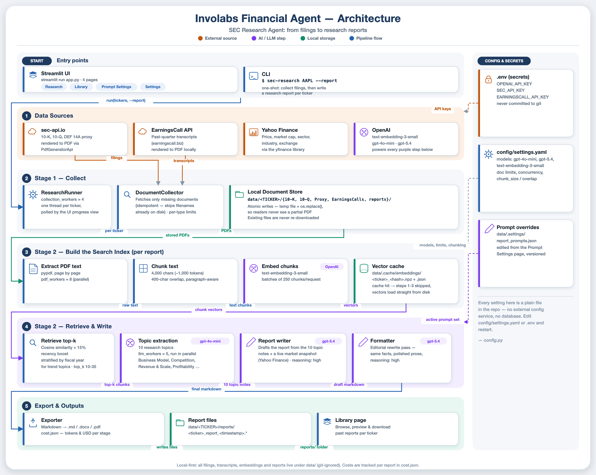

# Architecture

This document describes how the pieces of `sec-research-agent` fit together: the two entry
points, the document-collection pipeline, the report pipeline, the on-disk storage layout, the
embedding cache, the concurrency model, and how failures are handled. See
[configuration.md](configuration.md) for what every setting does, and the [README](../README.md)
for how to run the project.



## Entry points

There are two entry points, and both drive the same code:

- **Streamlit UI** (`app.py` -> `sec_research_agent.ui.app.main`) - a four-page app (Research,
  Library, Prompt settings, Settings).
- **CLI** (`sec-research` -> `sec_research_agent.cli.main`) - `sec-research AAPL MSFT [--report]`.

Both construct a `sec_research_agent.pipeline.runner.ResearchRunner` from the same
`Settings`/`AppConfig` singletons and call it the same way: `runner.start(tickers,
report_tickers)` (UI, non-blocking, polled every second by a `st.fragment`) or
`runner.run(progress)` (CLI, blocking). There is exactly one orchestration path; the UI adds no
logic of its own beyond turning `ResearchRunner`'s progress object into widgets.

## Components

```
Settings (.env)          AppConfig (config/settings.yaml)
        \                        /
         `---> ResearchRunner <-'
                     |
         .-----------+-----------------------------.
         |                                          |
   DocumentCollector                          ReportPipeline (per ticker, if requested)
         |                                          |
   sources/sec.py (sec-api.io)             documents.py: discover + extract PDFs
   sources/earnings.py (earningscall.biz)  rag/chunker.py: split into overlapping chunks
         |                                  rag/vector_store.py: embed + cache (OpenAI)
         v                                  sources/market.py: Yahoo Finance snapshot
   LocalDocumentStore                       rag/query_engine.py: per-topic retrieval + GPT
   data/<TICKER>/{10-K,10-Q,Proxy,          reports/generator.py: draft (GPT) -> polish (GPT)
                  EarningsCalls}/           reports/exporter.py: markdown -> md/docx/pdf
                                                      |
                                                      v
                                            data/<TICKER>/reports/
```

- **`ResearchRunner`** (`pipeline/runner.py`) - validates and de-duplicates the ticker list
  (`parse_tickers`), builds a `RunProgress` (one `TickerStatus` per ticker, updated under a
  lock), and runs collection and reports on two thread pools (see Concurrency below).
- **`DocumentCollector`** (`pipeline/collect.py`) - for one ticker, checks what's already on
  disk and fetches only what's missing, per document type (10-K, 10-Q, Proxy, EarningsCall).
  Idempotent: files already saved are never re-downloaded, so reruns are cheap.
- **`sources/sec.py`** / **`sources/earnings.py`** - thin wrappers around the `sec-api` and
  `earningscall` SDKs. Both translate provider-specific exceptions (rejected key, exhausted
  quota, rate limit, not found) into a shared `sources.errors.ProviderError` so the collector
  can react uniformly (see Error handling below).
- **`LocalDocumentStore`** (`storage.py`) - the only thing that knows the on-disk layout.
  Ticker symbols are validated (`normalize_ticker`) before ever touching the filesystem, and
  file writes go through `write_atomic` (temp file + rename) so a reader never sees a partial
  file.
- **`ReportPipeline`** (`pipeline/report.py`) - for one ticker with documents already
  collected, runs the report pipeline described below and writes `.md`/`.docx`/`.pdf` plus a
  `_cost.json`.

## Document collection

For each ticker, `DocumentCollector.collect()` loops over the four `DocType`s (`10-K`, `10-Q`,
`Proxy`, `EarningsCall`). For each type it:

1. Counts files already on disk (`LocalDocumentStore.existing_filenames`) and skips the type
   entirely if the configured limit (`documents.*` in `config/settings.yaml`) is already met or
   set to `0` - no network call at all.
2. Otherwise searches the provider for the most recent filings/calls, filters out ones already
   saved (by deterministic filename, or by fiscal period for earnings calls), and downloads the
   rest one at a time, saving each as it arrives.

Filenames encode the report/call period so re-runs can tell what's already saved without
re-querying the provider (`build_sec_filename`, `build_earnings_filename`,
`existing_periods`). A collection failure for one document type does not stop the others -
`CollectionResult.errors` accumulates a message per failed type, and the ticker is only marked
failed if *zero* documents ended up on disk.

## Report generation

`ReportPipeline.run(ticker)`, called only after collection has produced at least one document:

1. **Extract** - every stored PDF is read with `pypdf` in parallel (`documents.extract_all`,
   `concurrency.pdf_workers`). Zero readable documents raises `ReportError` immediately, before
   any paid API call is made.
2. **Chunk & embed** - `rag/chunker.py` splits each document's text into overlapping chunks
   (`retrieval.chunk_size` / `retrieval.chunk_overlap`, preferring paragraph boundaries), and
   `rag/vector_store.py` embeds them with `models.embedding` in batches of 250. Results are
   cached (see below) so re-running against unchanged documents costs nothing.
3. **Market snapshot** - `sources/market.py` fetches a price/market-cap snapshot from Yahoo
   Finance. This never raises: any failure is logged and the snapshot's fields stay `"N/A"`, so
   a Yahoo Finance outage degrades the report rather than blocking it.
4. **Retrieve & extract** - for each topic in
   `reports/templates/topics.yaml`, `rag/query_engine.py` retrieves the most relevant chunks
   (cosine similarity blended with a recency boost, optionally stratified across fiscal years)
   and asks `models.extraction` to summarize them. Topics run in parallel
   (`concurrency.llm_workers`); a topic whose extraction call fails is logged and skipped
   rather than aborting the report - if every topic fails, `ReportError` is raised.
5. **Draft & polish** - `reports/generator.py` assembles the topic extractions, the market
   snapshot and the document list into one prompt; `models.report` drafts the report and
   `models.formatting` does an editorial rewrite pass.
6. **Export & cost** - `reports/exporter.py` renders the final Markdown to `.md`, `.docx` and
   `.pdf`; `pricing.py` prices every stage's token usage against the `pricing` table and writes
   `<...>_cost.json` alongside the report.

A ticker missing an entire document type (e.g. no earnings calls collected, because the
`EARNINGSCALL_API_KEY` was never set) does not fail the report: topics scoped to that document
type simply retrieve no chunks for it, and the rest of the report is built from what is
available.

## Storage layout

```
data/
└── <TICKER>/
    ├── 10-K/             annual reports (PDF)
    ├── 10-Q/             quarterly reports (PDF)
    ├── Proxy/            DEF 14A proxy statements (PDF)
    ├── EarningsCalls/    earnings-call transcripts, rendered to PDF
    └── reports/
        ├── <TICKER>_report_<timestamp>.md
        ├── <TICKER>_report_<timestamp>.docx
        ├── <TICKER>_report_<timestamp>.pdf
        └── <TICKER>_report_<timestamp>_cost.json
data/.cache/embeddings/    embedding cache (see below)
data/.settings/report_prompts.json   user-edited prompt overrides + history
```

Every path under `data/` is derived from `Settings.data_dir` (`DATA_DIR` env var, default
`./data`); `LocalDocumentStore` is the only code that builds paths under it, and ticker symbols
are validated against `storage.TICKER_PATTERN` before being used in a path.

## Embedding cache

**Location**: `<data_dir>/.cache/embeddings/<key>.npz` (the embedding matrix and per-chunk
recency scores, via `numpy.savez_compressed`) plus `<key>.json` (cache format version, embed
model, chunk metadata and token usage) - no pickle.

**Key**: `f"{ticker}_{sha256(fingerprint)[:16]}"`, where the fingerprint is every document's
filename and character count, the embedding model, and the chunk size/overlap, joined together
(`pipeline.report._cache_key`). Any change to the document set, the embedding model, or the
chunking parameters therefore produces a different key - the pipeline never has to inspect or
invalidate an old cache entry, it just misses and rebuilds under the new key.

**Retrieval**: on each report run, `ReportPipeline._build_index` computes the key and calls
`VectorStore.load()`. A hit skips embedding entirely (`retrieval.use_cache: false` disables this
check and always rebuilds); a miss chunks and embeds the documents, then writes the cache. The
loaded metadata's chunk count is cross-checked against the embedding matrix's row count as a
consistency guard.

**Concurrency**: cache files are written atomically (`storage.write_atomic`: temp file +
`os.replace`), so a reader never observes a half-written pair of files - important because two
report runs can write to *the same* cache path if the same ticker is reported on concurrently
(e.g. two separate CLI invocations, or two browser tabs against the same Streamlit process).
Loading is best-effort: any failure to parse the cache (missing file, version/model mismatch,
truncated archive from a writer that was still in flight, chunk/embedding count mismatch) is
treated as a cache miss and logged at `WARNING`, never raised. Two report workers processing
*different* tickers never collide, because the ticker is part of the cache key.

## Concurrency model

`ResearchRunner._run` uses two thread pools, sized from `config.concurrency`:

- **`collection_workers`** (default 4) - one `DocumentCollector.collect(ticker)` call per
  worker thread. All tickers share one `DocumentCollector` instance for the run (see Error
  handling below).
- **`report_workers`** (default 2) - as soon as a ticker finishes collection, its report (if
  requested) is submitted to this smaller pool, so report generation doesn't wait for every
  ticker's documents to finish downloading first, while still bounding concurrent LLM usage.

Within one report, **`llm_workers`** (default 5) bounds parallel per-topic extraction calls
(`rag/query_engine.py`) and **`pdf_workers`** (default 8) bounds parallel PDF text extraction
(`documents.extract_all`). `RunProgress` (shared across every worker thread) guards all
mutation with a single `threading.Lock`; `RunProgress.snapshot()` returns a deep copy so the UI
can read progress without holding that lock.

## Error handling

Two error categories are treated differently throughout the collection path:

- **Expected provider failures** - a rejected API key, an exhausted quota, sustained rate
  limiting, or "not found" - are raised as `sources.errors.ProviderError` by `sources/sec.py`
  and `sources/earnings.py` (parsed from sec-api's HTTP status codes, or caught from
  earningscall's own exception types). `DocumentCollector` logs these as **one clean line** at
  `ERROR` (the full traceback still goes to `DEBUG`, so `LOG_LEVEL=DEBUG` recovers it), and a
  `fatal=True` error (bad key, exhausted quota) **disables that provider for the rest of the
  run**: every later call for that ticker, and every subsequent ticker sharing the same
  `DocumentCollector`, short-circuits with a "skipped" message instead of hitting an API that
  has already said no.
- **Unexpected exceptions** (bugs, unrecognized errors) still get a full traceback via
  `logger.exception` at `ERROR`, so they remain easy to diagnose and are never silently
  swallowed.

A ticker is only marked `Stage.FAILED` if collection produced zero documents on disk, if it
wanted a report but the report pipeline could not be constructed (e.g. no `OPENAI_API_KEY`), or
if report generation itself raised. A crash while processing one ticker never affects another
ticker running in the same or a different pool.
